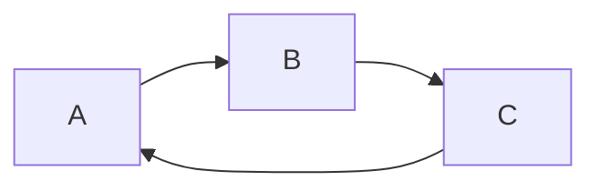
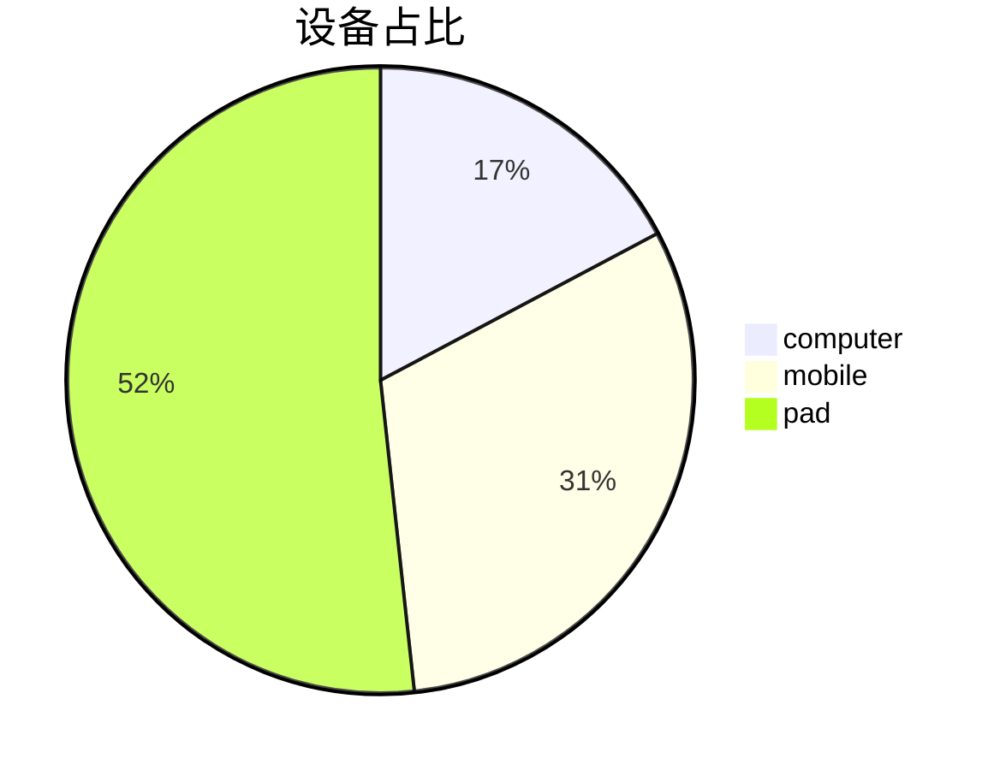

==Markdown 写文档很酷，Markdown文件的后缀名便是“.md”。==\[[~Markdown教程~](https://www.markdown.cn/)]

## 一、什么是 Markdown？

Markdown 是一种面向写作的轻量级标记语言，你可以使用它向纯文本文档添加格式元素。Markdown 由 [John Gruber](https://daringfireball.net/projects/markdown/)（约翰·格鲁伯）于 2004 年创建的一种轻量级标记语言（markup language），用 `#`、`*`、`-` 这类符号来表示标题、强调和列表，本质是给人写、给程序解析的纯文本格式。

## 二、为何使用 Markdown？

你可能想知道，人们为何使用 Markdown 而不是所见即所得编辑器。为什么在界面中按按钮格式化文本时还要使用 Markdown 来编写？事实证明，人们使用 Markdown 而不是所见即所得编辑器的原因有很多。

* Markdown 可用于一切。人们使用它来创建 [网站](https://www.markdown.cn/docs/intro#websites)、[文档](https://www.markdown.cn/docs/intro#documents)、[笔记](https://www.markdown.cn/docs/intro#notes)、[书籍](https://www.markdown.cn/docs/intro#books)、[演示文稿](https://www.markdown.cn/docs/intro#presentations)、[电子邮件](https://www.markdown.cn/docs/intro#email) 和 [技术文档](https://www.markdown.cn/docs/intro#documentation)。
* Markdown 是可移植的。包含 Markdown 格式文本的文件几乎可以使用任何应用程序打开。如果你决定不喜欢当前使用的 Markdown 应用程序，你可以将 Markdown 文件导入另一个 Markdown 应用程序。这与 Microsoft Word 等将内容锁定为专有文件格式的文字处理应用程序形成了鲜明的对比。
* Markdown 与平台无关。你可以在运行任何操作系统的任何设备上创建 Markdown 格式的文本。
* Markdown 具有未来性。即使你使用的应用程序在未来某个时间点停止工作，你仍然可以使用文本编辑应用程序阅读 Markdown 格式的文本。对于需要无限期保存的书籍、大学论文和其他里程碑式文档，这是一个重要的考虑因素。
* Markdown 无处不在。像 [Reddit](https://www.markdown.cn/docs/tutorial-extras/tools#reddit) 和 GitHub 这样的网站支持 Markdown，并且许多桌面和基于 Web 的应用程序也支持它。

## 三、试用

​[Dillinger](https://dillinger.io/) 是最好的在线 Markdown 编辑器之一。只需打开网站，然后开始在左窗格中键入。已呈现文档的预览将显示在右窗格中。

## 四、它是如何工作的？

当使用 Markdown 书写时，文本会存储在具有 .md 或 .markdown 扩展名的纯文本文件中。

Markdown 应用程序使用称为Markdown 处理器（通常也称为“解析器”或“实现”）的东西，将 Markdown 格式的文本提取出来并将其输出为 HTML 格式。

总而言之，这是一个由四部分组成的过程

1. 使用文本编辑器或专门的 Markdown 应用程序创建 Markdown 文件。该文件应具有 .md 或 .markdown 扩展名。
2. 在 Markdown 应用程序中打开 Markdown 文件。
3. 使用 Markdown 应用程序将 Markdown 文件转换为 HTML 文档。
4. 在网络浏览器中查看 HTML 文件，或使用 Markdown 应用程序将其转换为其他文件格式，例如 PDF。

## 五、Markdown 有什么用？

Markdown不是让你去学写代码，而是让你学会如何**结构化表达，因为 **AI 很吃结构。

1. **优化 Prompt，提升代码生成质量**：用`#`分 “任务 / 背景 / 要求”、`-`列具体需求、**加粗**关键限制、\`\`\` 包裹示例代码，帮 AI 精准理解意图（如明确语言 / 功能），减少错误；还能通过结构化 “身份 - 目标 - 规则 - 格式” 模板（如指定 Python / 避免全局变量）强化指令，配合精确标记函数名（如`useState`）避免歧义。
2. **辅助 AI 工具协作与项目管理**：主流工具（GitHub Copilot、Claude Code）支持`.md`配置文件（如`copilot-instructions.md`）固化项目规则，AI 自动遵循；VS Code 等编辑器原生支持，可直接在注释用 Markdown 写逻辑步骤，AI 能解析生成代码，甚至通过 “规范驱动开发”（写`main.md`逻辑→AI 编译代码）快速迭代原型。
3. **高效学习与知识沉淀**：记笔记时用`#`分层（如 “算法 / 动态规划”）、`>`存教材原文 + 自己理解、\`\`\` 存代码片段，AI 可直接解析笔记补全解释 / 优化代码；分析 AI 输出时，用表格对比方案（如 “方法 - 优点 - 缺点”）、列表梳理步骤，快速定位逻辑；复盘时用 Markdown 整理问题 - 方案 - 改进，形成可复用知识库。
4. **降低入门门槛**：纯文本易读易写，无需排版；AI 输出的标题 / 列表 / 代码块天然可直接复制修改，减少格式转换；聚焦 “描述问题” 而非语法，帮新手先理清逻辑（编程核心），再学代码细节。

## 六、语法

Markdown 只是一套在文字里加标记的简单规则。重点掌握下面五个符号：

* 第一个：# 井号，表示标题。标题不是为了把字变大，它的作用是先分层，自己写的时候不容易散，AI 看你的需求时也更容易知道每块内容在干什么。
* 第二个：-/\* 短横线，表示列表。列表特别适合写要求，自己问 AI 的时候能拆成列表就尽量拆，原因很简单，一条一条摆出来，AI 漏掉的概率会低一点，自己也能检查这个要求是不是太多了，有没有互相打架。
* 第三个：\*\* 两个星号，表示加粗。把重要的词或句子前后各加两个星号，它就会变成重点。但加粗不要滥用，满篇都加粗最后等于没加。我一般只标两类东西，一个是结论，一个是我希望 AI 别忽略的限制条件。
* 第四个：> 大于号，表示引用。断手打一个大于号再加一个空格，就是引用。快引用最适合把原话和自己的判断分开写，笔记时尤其有用。
* 第五个：\`\` 反引号，表示精确信息。把命令、字段名、产品名、文件名这类精确信息前后各加一个反引号。这个符号对 AI 提问很有用，写帮我解释 hook，AI 可能会按普通英文单词理解。写帮我解释 code 里的 hook，并且把  `code`  和  `hook`  都用反引号标出来，它更容易知道这是一个具体工具里的具体功能。

【案例】让 AI 写一篇小红书文案，很多人会这么写 Prompt："==帮我写一篇小红书文案，主题是 Markdown 入门，面向普通人，不要太技术，最好有案例，语气轻松一点。==" 

* 这句话其实不差，问题是所有东西都挤在一起了，AI 要自己分辨主题是什么，读者是谁？哪些是硬要求？那些只是偏好？
* 换成 Markdown 可以这样写：
  * 任务是什么？
  * 主题是什么？
  * 目标读者是谁？
  * 具体要求有哪些？
* 它没有多复杂，只是把话拆开了。这里不是 AI 突然变聪明了，更常见的情况是在拆标题和列表的时候，自己先想清楚了一遍。
* Markdown 的好处是它会逼你停一下，先写任务，再写背景，再写要求。
* 换成 Markdown，用标题分层，用列表整理，用引用标重点，不需要多写多少字，信息已经分开了。

## 六、工具

* 单文件写作 选   **Typora**
* 个人知识库 选   **Obsidian**
* 团队协作 选**      飞书文档**

最后，其实 Markdown 不难，难的是我们平时太习惯把一堆想法揉成一段话，然后丢给 AI 猜。下次你问 ChatGPT 或 Cloud，可以先别管别的，就把需求拆成三块，任务、背景、要求，先试一次，你很快会发现 AI 回答会更清楚，你自己也会更清楚。

## 七、与HTML区别？

Markdown 和 HTML 核心区别：**Markdown 是 “写作者友好的简化工具”（侧重快速结构化内容），HTML 是 “浏览器友好的完整标准”（侧重精确控制网页呈现）**，二者非对立 ——Markdown 最终常转 HTML 渲染，实际工作常结合使用。

| **对比维度**   | **Markdown**                                   | **HTML**                                         |
| ----------------------------------------------- | ----------------------------------------------------------------------------------- | ------------------------------------------------------------------------------------- |
| **设计目的**   | 2004 年为普通人设计，纯文本易读易写，专注 “写内容”（如笔记 / 文档）        | 1990 年代为网页设计，定义网页结构，专注 “控呈现”（如布局 / 交互）           |
| **学习与可读性** | 极简（10 分钟掌握 #标题 /- 列表 /**加粗**），源码像普通笔记（如`# 标题`） | 需学百级标签（如`<h1>`/`<ul>`），源码满是尖括号难读（如`<h1>标题</h1>`） |
| **功能与控制**  | 仅基础格式（标题 / 列表 / 代码块），表格无合并、无交互                 | 全功能（表单 / 视频 / 复杂表格），可通过 CSS/JS 控样式交互             |
| **适用场景**   | 写 README / 技术文档 / 个人笔记 / AI 对话（效率优先）           | 建网站 / 邮件模板 / 需布局的页面（控制优先）                        |
| **依赖与转换**  | 需工具转 HTML（GitHub / 编辑器自动处理），平台支持有差异（如 GFM 表格）  | 浏览器原生解析，独立可用                                     |

## 八、其它

1. mermaid









2. 公式

3. 图床
   * [~Obsidian + Picgo + Gitee~](https://www.cnblogs.com/lvwd/p/19646699#commentform#1)
   * [~Typora + Picgo + Github~](https://developer.aliyun.com/article/1720308#1)

​
