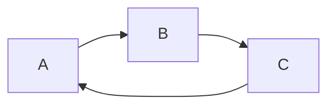
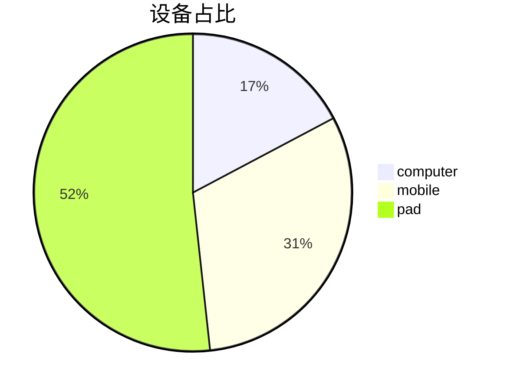

# 《新媒体交互设计》——第8讲 Markdown

***

2026.10.10

***

==Markdown 写文档很酷，Markdown文件的后缀名便是“.md”。==\[[~Markdown教程~](https://www.markdown.cn/)]

# 一、什么是 Markdown？

Markdown 是一种面向写作的轻量级标记语言，你可以使用它向纯文本文档添加格式元素。Markdown 由 [John Gruber](https://daringfireball.net/projects/markdown/)（约翰·格鲁伯）于 2004 年创建的一种轻量级标记语言（markup language），用 `#`、`*`、`-` 这类符号来表示标题、强调和列表，本质是给人写、给程序解析的纯文本格式。

# 二、为何使用 Markdown？

## **Markdown 是 AI 的"母语"**

**Markdown 是 AI 最主流的输出格式。**

原因：

1. **训练数据多**：GitHub、文档、论坛大量使用 Markdown，模型天然熟悉。
2. **结构清晰**：标题、列表、表格、代码块都能用简单符号表达。
3. **易读易解析**：人看着舒服，程序也容易转成 HTML。
4. **token 效率高**：比 HTML 标签更省 token。

典型场景：

* ChatGPT / Claude / DeepSeek 默认用 Markdown 回复
* AI 写文档、README、笔记
* AI 生成结构化内容（表格、步骤、代码）

# 三、试用

[Dillinger](https://dillinger.io/) 是最好的在线 Markdown 编辑器之一。只需打开网站，然后开始在左窗格中键入。已呈现文档的预览将显示在右窗格中。


# 四、它是如何工作的？

当使用 Markdown 书写时，文本会存储在具有 .md 或 .markdown 扩展名的纯文本文件中。

Markdown 应用程序使用称为Markdown 处理器（通常也称为“解析器”或“实现”）的东西，将 Markdown 格式的文本提取出来并将其输出为 HTML 格式。


总而言之，这是一个由四部分组成的过程

1. 使用文本编辑器或专门的 Markdown 应用程序创建 Markdown 文件。该文件应具有 .md 或 .markdown 扩展名。
2. 在 Markdown 应用程序中打开 Markdown 文件。
3. 使用 Markdown 应用程序将 Markdown 文件转换为 HTML 文档。
4. 在网络浏览器中查看 HTML 文件，或使用 Markdown 应用程序将其转换为其他文件格式，例如 PDF。

# 五、Markdown 有什么用？

Markdown不是让你去学写代码，而是让你学会如何**结构化表达，因为&#x20;**&#x41;I 很吃结构。

1. **优化 Prompt，提升代码生成质量**：用`#`分 “任务 / 背景 / 要求”、`-`列具体需求、**加粗**关键限制、\`\`\` 包裹示例代码，帮 AI 精准理解意图（如明确语言 / 功能），减少错误；还能通过结构化 “身份 - 目标 - 规则 - 格式” 模板（如指定 Python / 避免全局变量）强化指令，配合精确标记函数名（如`useState`）避免歧义。
2. **辅助 AI 工具协作与项目管理**：主流工具（GitHub Copilot、Claude Code）支持`.md`配置文件（如`copilot-instructions.md`）固化项目规则，AI 自动遵循；VS Code 等编辑器原生支持，可直接在注释用 Markdown 写逻辑步骤，AI 能解析生成代码，甚至通过 “规范驱动开发”（写`main.md`逻辑→AI 编译代码）快速迭代原型。
3. **高效学习与知识沉淀**：记笔记时用`#`分层（如 “算法 / 动态规划”）、`>`存教材原文 + 自己理解、\`\`\` 存代码片段，AI 可直接解析笔记补全解释 / 优化代码；分析 AI 输出时，用表格对比方案（如 “方法 - 优点 - 缺点”）、列表梳理步骤，快速定位逻辑；复盘时用 Markdown 整理问题 - 方案 - 改进，形成可复用知识库。
4. **降低入门门槛**：纯文本易读易写，无需排版；AI 输出的标题 / 列表 / 代码块天然可直接复制修改，减少格式转换；聚焦 “描述问题” 而非语法，帮新手先理清逻辑（编程核心），再学代码细节。

# 六、语法

Markdown 只是一套在文字里加标记的简单规则。重点掌握下面五个符号：

* 第一个：# 井号，表示标题。标题不是为了把字变大，它的作用是先分层，自己写的时候不容易散，AI 看你的需求时也更容易知道每块内容在干什么。
* 第二个：-/\* 短横线，表示列表。列表特别适合写要求，自己问 AI 的时候能拆成列表就尽量拆，原因很简单，一条一条摆出来，AI 漏掉的概率会低一点，自己也能检查这个要求是不是太多了，有没有互相打架。
* 第三个：\*\* 两个星号，表示加粗。把重要的词或句子前后各加两个星号，它就会变成重点。但加粗不要滥用，满篇都加粗最后等于没加。我一般只标两类东西，一个是结论，一个是我希望 AI 别忽略的限制条件。
* 第四个：> 大于号，表示引用。断手打一个大于号再加一个空格，就是引用。快引用最适合把原话和自己的判断分开写，笔记时尤其有用。
* 第五个：\`\` 反引号，表示精确信息。把命令、字段名、产品名、文件名这类精确信息前后各加一个反引号。这个符号对 AI 提问很有用，写帮我解释 hook，AI 可能会按普通英文单词理解。写帮我解释 code 里的 hook，并且把  `code`  和  `hook`  都用反引号标出来，它更容易知道这是一个具体工具里的具体功能。

【案例】让 AI 写一篇小红书文案，很多人会这么写 Prompt："==帮我写一篇小红书文案，主题是 Markdown 入门，面向普通人，不要太技术，最好有案例，语气轻松一点。==" 

* 这句话其实不差，问题是所有东西都挤在一起了，AI 要自己分辨主题是什么，读者是谁？哪些是硬要求？那些只是偏好？
* 换成 Markdown 可以这样写：
  * 任务是什么？
  * 主题是什么？
  * 目标读者是谁？
  * 具体要求有哪些？
* 它没有多复杂，只是把话拆开了。这里不是 AI 突然变聪明了，更常见的情况是在拆标题和列表的时候，自己先想清楚了一遍。
* Markdown 的好处是它会逼你停一下，先写任务，再写背景，再写要求。
* 换成 Markdown，用标题分层，用列表整理，用引用标重点，不需要多写多少字，信息已经分开了。

```
【小红书便携咖啡机推广 · 提示词】
你是资深小红书运营。帮我写一篇推广便携咖啡机的笔记。背景：目标用户是25-35岁上班族，卖点是3秒出热水、可折叠。要求：1. 标题带emoji 2. 正文300字内 3. 口语化 4. 结尾带话题标签
```

标准提示词的6大构成：

| **部分**  | **作用**            | **是否必需** |
| ------- | ----------------- | -------- |
| 1. 角色   | 告诉AI“你是谁”         | 推荐       |
| 2. 任务   | 告诉AI“做什么”         | 必需       |
| 3. 背景   | 告诉AI“为什么/在什么情况下做” | 推荐       |
| 4. 要求   | 告诉AI“怎么做”         | 必需       |
| 5. 输出格式 | 告诉AI“结果长什么样”      | 推荐       |
| 6. 示例   | 给AI一个“参考答案”       | 可选       |

```markdown
# 角色
你是资深小红书运营，擅长写种草类笔记，熟悉25-35岁上班族的内容偏好和平台爆款逻辑。

# 任务
帮我写一篇推广便携咖啡机的种草笔记。

# 背景
- 目标用户：25-35岁上班族
- 产品卖点：3秒出热水、可折叠
- 投放平台：小红书

# 要求
1. 标题带 emoji，有吸引力但不夸张
2. 正文控制在 300 字以内
3. 语言口语化，像朋友分享，不要广告腔
4. 结尾带话题标签（3-5个）
5. 正文里自然植入两个卖点，不要硬广

# 输出格式
Markdown 格式：
- 第一行：标题
- 正文分段，适当加 emoji
- 最后一行：话题标签

# 补充
如果信息不足，请先问我2-3个关键问题再动笔。
```

# 六、工具

## **MarkitDown**

**MarkItDown 是微软开源的一款轻量级文档转换工具。**[**~https://github.com/microsoft/markitdown~**](https://github.com/microsoft/markitdown)​

* **它解决什么问题**

大模型最擅长处理 Markdown 这类结构化文本，但现实中的资料却是 PDF、Word、Excel、PPT、图片等各种格式，含大量排版噪声。MarkItDown 就是中间&#x7684;**"翻译器"**：不管源文件多复杂，统一转成干净的 Markdown 再喂给模型。

* **支持的格式**
  * **办公文档**：Word、Excel、PowerPoint、PDF
  * **结构化数据**：HTML、CSV、JSON、XML
  * **多媒体**：图片（通过 OCR 识别文字）、音频（语音转录）
  * **其他**：EPub、ZIP 压缩包、YouTube 视频链接等

**MarkItDown = 文档界的格式翻译官**，把 PDF、Word、图片、音频等统统转成 Markdown，让大模型能轻松读懂、索引和处理各种资料。

## 编辑器

* 单文件写作 选   **Typora**
* 个人知识库 选   **Obsidian**
* 团队协作 &#x9009;**&#x20;     飞书文档**

最后，其实 Markdown 不难，难的是我们平时太习惯把一堆想法揉成一段话，然后丢给 AI 猜。下次你问 ChatGPT 或 Cloud，可以先别管别的，就把需求拆成三块，任务、背景、要求，先试一次，你很快会发现 AI 回答会更清楚，你自己也会更清楚。

# 七、与HTML区别？

**Markdown 和 HTML 是 AI 世界的"通用文字载体"——Markdown 是 AI 最自然的输出语言，HTML 是它最终落地的呈现格式，两者构成了 AI 与人类、AI 与网页之间的"翻译层"。**

| **格式**       | **本质**    | **特点**               |
| ------------ | --------- | -------------------- |
| **Markdown** | 轻量级标记语言   | 语法极简，纯文本可读，专注于"内容结构" |
| **HTML**     | 网页超文本标记语言 | 描述完整网页结构与样式，能被浏览器渲染  |

Markdown 和 HTML 核心区别：**Markdown 是 “写作者友好的简化工具”（侧重快速结构化内容），HTML 是 “浏览器友好的完整标准”（侧重精确控制网页呈现）**，二者非对立 ——Markdown 最终常转 HTML 渲染，实际工作常结合使用。

## AI 与 HTML 的关系

**HTML 是 AI 内容的最终落地形态之一。**

关系体现在：

1. **AI 可以生成 HTML**：写网页、邮件模板、报告页面。
2. **AI 可以解析 HTML**：爬虫、网页理解、信息抽取。
3. **AI 输出常被转成 HTML**：Markdown 渲染器把 AI 回复转成 HTML 显示在网页上。
4. **AI 智能体操作 HTML**：浏览器自动化、点击按钮、填表单。

**AI ↔ HTML 是“生成 + 解析 + 操作”的双向关系。**

# 八、其它

1. mermaid







2. 公式


3. 图床
   * [~Obsidian + Picgo + Gitee~](https://www.cnblogs.com/lvwd/p/19646699#commentform#1)
   * [~Typora + Picgo + Github~](https://developer.aliyun.com/article/1720308#1)
   * 需要获取访问令牌（Token）

# 九、作业2

每人在Github上建立并部署自己的个人博客网站（Blog），展示学习心得和知识经验（Markdown格式）：

1. Wiki（个人知识库） —> LLM + Obsidian + Picgo + 图床（Gitee/Github）
2. Blog（个人博客）技术栈如下图：

| **生成器**             | **与 GitHub Pages 关系**   | **内容模型**     | **适合**     | **主要短板**             |
| ------------------- | ----------------------- | ------------ | ---------- | -------------------- |
| **Jekyll**          | ✅ 原生，自动构建免 Actions | 博客式（按日期文章）   | 个人博客、写作记录  | Ruby 环境、构建较慢、插件白名单受限 |
| **MkDocs Material** | 需 Actions               | 文档/知识库（侧边目录） | 结构化笔记、Wiki | 需自己配部署               |
| **VitePress**       | 需 Actions               | 现代文档         | 技术笔记       | 需 Node 环境            |
| **Hugo**            | 需 Actions               | 任意（极快）       | 海量笔记       | 模板语法略陡               |

3. 注意与作业1（Assignment1的区分），可新建仓库Blog或Assignment2定义站点，后面的作业亦是如此。
